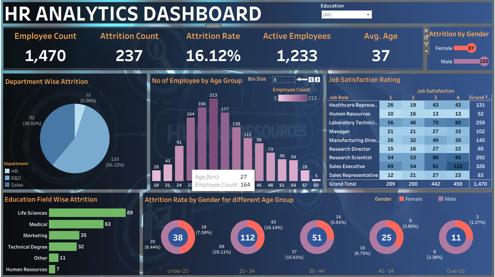

# HR Analytics Tableau Dashboard

Interactive HR Analytics Dashboard built using Tableau.

## Project Overview

This HR Analytics Dashboard was created in Tableau to analyze employee attrition, workforce demographics, job satisfaction, and departmental performance. The dashboard helps HR teams identify trends and make data-driven decisions.

## Dashboard Screenshot

## Key Metrics
- Employee Count: 1470
- Attrition Count: 237
- Attrition Rate: 16.12%
- Active Employees: 1233
- Average Age: 37

## Insights
- Department-wise Attrition
- Employee Age Distribution
- Job Satisfaction Analysis
- Education Field-wise Attrition
- Gender-wise Attrition Trends

## Tools Used
- Tableau
- Excel

## Files

- HR Analytics Dashboard.tableau.twb – Tableau Workbook
- hr_analytics_dashboard.png – Dashboard Screenshot
